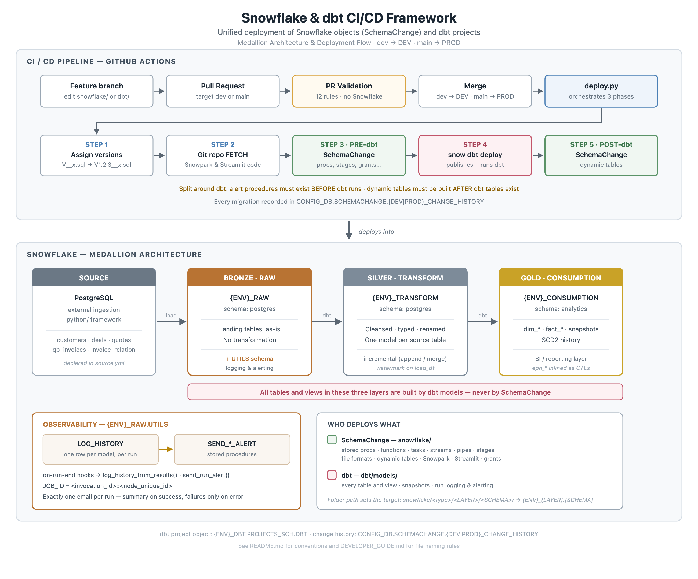

# Snowflake & dbt CI/CD Framework

**Unified deployment for Snowflake objects (SchemaChange) and dbt projects (dbt on Snowflake)**

Author : Abhijit Bangal



<sub>Source: [`docs/architecture.svg`](docs/architecture.svg) — edit the SVG, then re-export the PNG (see [Regenerating the diagram](#regenerating-the-diagram)).</sub>

---

## New here? Read these first

| If you want to… | Go to |
|---|---|
| Understand the end-to-end flow | [High Level Architecture](#high-level-architecture) → [What deploy does](#4-what-deploy-does) |
| Know **where a new file belongs** | [Adding Something New — Quick Index](#adding-something-new--quick-index) |
| Add a table, view, dim or fact | [dbt Projects on Snowflake](#dbt-projects-on-snowflake) |
| Add a stored procedure, grant, task or Streamlit app | [DEVELOPER_GUIDE.md](DEVELOPER_GUIDE.md) |
| Understand the email alerts and `LOG_HISTORY` | [Run Logging & Email Alerts](#run-logging--email-alerts) |
| Know why a deployment failed in a dbt hook | [Why deployment is split around dbt](#why-deployment-is-split-around-dbt) |

**The single most important rule:** tables and views are owned by **dbt** (`dbt/models/`). Everything else — procedures, grants, tasks, stages, Streamlit — is owned by **SchemaChange** (`snowflake/`). Putting a table in `snowflake/` will fail PR validation.

---

# Overview

This repository contains a reusable CI/CD framework that deploys **two things from one pipeline**:

| Deployed | Tool | Source folder | Covers |
|---|---|---|---|
| Snowflake objects | **SchemaChange** | `snowflake/` | stored procedures, functions, tasks, streams, pipes, stages, file formats, dynamic tables, Snowpark, Streamlit, grants |
| dbt project | **`snow dbt deploy`** | `dbt/` | every table and view — raw, transform and consumption models, snapshots, run logging and alerting |

A single merge to `dev` or `main` deploys both, in the correct order, to the matching environment. External Python ingestion code (`python/`) runs outside Snowflake and is version-controlled alongside.

The framework has been designed with the following objectives:

- Single deployment framework for all Snowflake projects
- Environment independent SQL scripts
- Git based version control
- Automated deployments
- Automatic validation before deployment
- Support for Snowpark projects
- Support for external Python ingestion framework
- Metadata driven folder structure
- Config-driven grants per environment and layer (RAW / TRANSFORM / CONSUMPTION)
- Easy onboarding for new developers
- Scalable repository structure

The framework follows Infrastructure as Code (IaC) principles where every Snowflake object is stored in Git and deployed automatically using GitHub Actions.

---

# High Level Architecture

The diagram at the top of this README shows the full picture. The text version below covers the same flow.

<details>
<summary>Text version of the flow</summary>

```
                GitHub Repository

                       │

         Merge into dev / main branch

                       │

              GitHub Actions Trigger

                       │

                 PR Validation

                       │

        Validate Repository Structure

                       │

        Validate SchemaChange Naming

                       │

                Deploy Pipeline

                       │

            Connect to Snowflake

                       │

      ALTER GIT REPOSITORY FETCH

                       │

    SchemaChange — PRE-dbt object types
    (stored procedures, stages, functions …)

                       │

          snow dbt deploy
     (publishes + runs the dbt project)

                       │

    SchemaChange — POST-dbt object types
    (dynamic tables — anything reading dbt tables)

                       │

             Update Change History
```

</details>

## Why deployment is split around dbt

dbt and SchemaChange depend on each other's output in **opposite directions**, so a single ordering cannot satisfy both:

| Dependency | Requirement |
|---|---|
| dbt's `on-run-end` hooks call `RAW.UTILS.SEND_SUCCESS_ALERT` / `SEND_FAILURE_ALERT` | Those procedures must exist **before** dbt runs |
| A dynamic table doing `SELECT … FROM <a dbt model>` | The dbt tables must exist **before** that DDL runs |

`deploy.py` therefore runs SchemaChange **twice**, around the dbt step. Which object types land in which pass is decided in code by
`SchemaChangeRunner.POST_DBT_OBJECT_TYPES` (`deployment/core/schemachange_runner.py`) — deliberately not in `deployment.yml`, because it is a structural rule about how the two tools interact, not a per-environment setting.

Today only `dynamic_tables` runs after dbt. **If you add an object type that reads a dbt-built table, add its name to that set** or it will deploy before the table exists.

---

# How It Works

This is the end-to-end flow from developer commit to Snowflake deployment.

## 1. Developer workflow

> **Conventions & Snowpark setup:** See [DEVELOPER_GUIDE.md](DEVELOPER_GUIDE.md) for file naming rules, Snowpark SP layout, and do's / don'ts.

1. Create a **feature branch** from `dev` or `main`.
2. Add or update SQL migrations under `snowflake/<object_type>/<database>/<schema>/`.
3. Open a **Pull Request** targeting `dev` or `main`.

## 2. Pull Request (before merge)

When a PR is opened or updated against `dev` or `main`, **PR Validation** runs automatically.

It checks:

- Repository folder structure
- Migration file naming (`V__*.sql` placeholders, `R__*.sql`)
- Duplicate version numbers among already-assigned `V*.*.*__*.sql` files
- No edits to already-deployed versioned migrations
- `access_roles` configuration when grant scripts exist
- No hardcoded `DEV_RAW` / `PROD_RAW` in views or dynamic tables (use `{{ databases.RAW }}`)
- No hardcoded `WH_DEV_*` / `WH_PROD_*` in dynamic tables or tasks (use `{{ warehouses.ELT }}`)
- `snowflake/streamlit/` and `snowflake/streamlit_apps/` structure when Streamlit apps exist
- Streamlit SQL uses `{{ git_repository }}`, `{{ git_branch }}`, and `{{ warehouses.* }}` (no hardcoded paths or warehouses)

This step does **not** connect to Snowflake. It blocks bad changes before merge.

## 3. Merge triggers deployment

When the PR is **merged** into `dev` or `main`, GitHub pushes to that branch and **Deploy** runs automatically.

| Branch merged into | Snowflake environment | Example database |
|---|---|---|
| `dev` | DEV | `DEV_RAW`, `DEV_TRANSFORM` |
| `main` | PROD | `PROD_RAW`, `PROD_TRANSFORM` |

Direct pushes to `dev` or `main` also trigger deploy (avoid — use PRs only).

## 4. What deploy does

1. **Validate** the repository again.
2. **Assign migration versions** — rename `V__*.sql` placeholders to the next repo-wide version (e.g. `V__create_emp.sql` → `V3.2.0__create_emp.sql`) and commit back to the branch.
3. **Connect** to Snowflake using GitHub secrets.
4. **Fetch** the Snowflake Git Repository (if enabled — for Snowpark SPs and Streamlit apps).
5. **SchemaChange, pre-dbt pass** — every object type *except* those in `POST_DBT_OBJECT_TYPES`:
   - Folder path `snowflake/storedprocedures/RAW/UTILS/` → deploys to `DEV_RAW.UTILS`
   - Order follows `deployment_order` in `deployment.yml`: file formats → stages → streams → functions → **stored procedures** → tasks → pipes → snowpark → streamlit → grants
   - This is where the alert procedures are created, so they exist before dbt runs
6. **Deploy the dbt project** with `snow dbt deploy` — publishes `dbt/` as the Snowflake dbt project object.
   > **Important:** `snow dbt deploy` does not merely upload files — it also **executes** dbt (compile/parse), which fires the `on-run-end` hooks. That is why a bug in those hooks can fail a deployment. See [Run Logging & Email Alerts](#run-logging--email-alerts).
7. **SchemaChange, post-dbt pass** — object types that may read dbt-built tables (currently `dynamic_tables`).
8. **Record** applied migrations in the change history table (`CONFIG_DB.SCHEMACHANGE.DEV_CHANGE_HISTORY` or PROD equivalent).

**Tables and views are not deployed by SchemaChange** — they are owned by dbt models under `dbt/models/`. There are no `snowflake/tables/` or `snowflake/views/` folders, by design.

Each migration runs **once**. Repeatable scripts (`R__*.sql`) re-run only when their content changes.

## 5. Key rules

- Never commit directly to `dev` or `main` — always use a PR.
- Never edit a deployed `V*.sql` file — add a new **`V__description.sql`** placeholder instead.
- **Do not pick version numbers manually** — use `V__*.sql` placeholders; the deploy workflow assigns `V*.*.*__*.sql` automatically.
- Version numbers must be **unique across the entire repository** (enforced when versions are assigned).
- New database/schema folders are picked up automatically — no config changes needed.
- **Grants belong in `snowflake/grants/`** — do not add `GRANT` statements to table or stored procedure DDL files.
- **Streamlit Python** lives in `snowflake/streamlit_apps/`; **`CREATE STREAMLIT` SQL** lives in `snowflake/streamlit/`.
- Do not hardcode Git paths or `WH_DEV_*` / `WH_PROD_*` warehouse names in Streamlit SQL.

---

# dbt Projects on Snowflake

The whole `dbt/` folder is published to Snowflake as a **DBT PROJECT object** by `snow dbt deploy`.

| What | Where |
|---|---|
| dbt project source | `dbt/` |
| Deploy config | `deployment/config/deployment.yml` → `dbt:` |
| Runner | `deployment/core/dbt_deploy_runner.py` |
| Published object (dev) | `DEV_DBT.PROJECTS_SCH.DBT` (target `dev`) |
| Published object (prod) | `PROD_DBT.PROJECTS_SCH.DBT` (target `prod`) |

## Folder layout

```
dbt/
├── dbt_project.yml          project config + on-run-end hooks (deploy-time Jinja)
├── profiles.yml             connection template (deploy-time Jinja)
├── packages.yml             dbt packages (currently none active)
│
├── models/
│   ├── sources/source.yml   source() definitions -> raw Postgres landing tables
│   ├── transform/           cleansed / typed layer  -> DEV_TRANSFORM.postgres
│   │   ├── properties.yml   per-model config (see warning below)
│   │   └── *.sql
│   └── consumption/         dims and facts          -> DEV_CONSUMPTION.analytics
│       ├── ephemeral/       inlined CTEs, no table is created
│       └── *.sql
│
├── snapshots/               SCD2 history (YAML-defined)
├── macros/                  reusable Jinja - logging, alerting, SCD2 helpers
└── analyses/                ad-hoc SQL, never deployed as a model
```

## The three layers

| Layer | Folder | Database | Schema | Purpose |
|---|---|---|---|---|
| Source | `models/sources/` | `{{ databases.RAW }}` | `postgres` | Declares landing tables; creates nothing |
| Transform | `models/transform/` | `{{ databases.TRANSFORM }}` | `postgres` | Cleanse, rename, type-cast. One model per source table |
| Consumption | `models/consumption/` | `{{ databases.CONSUMPTION }}` | `analytics` | `dim_*` / `fact_*` for reporting |
| Ephemeral | `models/consumption/ephemeral/` | — | — | Inlined as a CTE; **no table is created** |

Databases come from `dbt_project.yml`; schemas come from each model's own `config()`.
`macros/generate_schema_name.sql` is overridden to return the custom schema **verbatim** — so `schema='analytics'` lands in `analytics`, *not* the dbt default `POSTGRES_analytics`.

## Naming conventions

| Object | Convention | Examples |
|---|---|---|
| Transform model | snake_case, mirrors the source table name | `customers.sql`, `qb_invoices.sql` |
| Dimension | `dim_<entity>` | `dim_invoices.sql`, `dim_deals.sql` |
| Fact | `fact_<process>` | `fact_deals.sql` |
| Ephemeral | `eph_<entity>` | `eph_customers.sql` |
| Snapshot | `dim_<entity>` in `snapshots/` | `dim_customers.yml` |
| Macro | verb or purpose, snake_case | `log_history_from_results.sql` |
| Columns | `_dt` = date, `_ts` = timestamp, `_id` = key | `created_dt`, `load_dt`, `quote_id` |

## How to add a new dbt model

**1. Declare the source** (only if it is a new landing table) in `models/sources/source.yml`:

```yaml
sources:
  - name: postgres
    database: {{ databases.RAW }}
    schema: postgres
    tables:
      - name: my_new_table          # <- add here
```

**2. Add the transform model** — `models/transform/my_new_table.sql`:

```sql
{{
config(
materialized = 'incremental',
incremental_strategy = 'append',
transient = false
)
}}
select
     id
    ,coalesce(name, '') name
    ,date(created_at) created_dt
    ,date(load_time) load_dt
from {{ source('postgres','my_new_table') }} c

where date(c.load_time) > (select coalesce(max(t.load_dt), date('2010-01-01')) from {{ this }} t)

```

**3. Add the consumption model** — `models/consumption/dim_my_new_table.sql`:

```sql
{{
config(
materialized = 'incremental',
schema = 'analytics',
incremental_strategy = 'merge',
unique_key = ['id']
)
}}
select * from {{ ref('my_new_table') }}
```

**4. Always use `ref()` / `source()`** — never write a hardcoded three-part name. `ref()` is what builds the DAG and the deploy order.

**5. Open a PR.** Validation runs `validate_dbt_project.py` and `validate_dbt_owned_objects.py` (which blocks tables/views being added to `snowflake/`).

## Choosing a materialization

| Strategy | When | Caveat |
|---|---|---|
| `table` | Small, full rebuild each run | CTAS reports no row count — logs `1` unless the `COUNT(*)` fallback is in place |
| `incremental` + `append` | Insert-only history | Needs an `is_incremental()` watermark or it re-inserts everything |
| `incremental` + `merge` | Upsert on a key | **Must set `unique_key`** — without it dbt inserts instead of updating |
| `ephemeral` | Reused CTE logic | No table exists; nothing to query or count |

### The incremental watermark pattern

Every incremental transform model uses:

```sql

where date(c.load_time) > (select coalesce(max(t.load_dt), date('2010-01-01')) from {{ this }} t)

```

This is **day-granularity with strict `>`**, which assumes **exactly one load per day**. That holds for the current daily batch, but be aware:

- A second batch **the same day is silently skipped** — permanently, with no error. You just see `0` in `LOG_HISTORY`.
- Hand-inserting a row to test the pipeline on an already-loaded day will look like a no-op.

If a source ever becomes intra-day, switch that model to a timestamp watermark (keep the full `load_time`, compare `>` on the timestamp) and `--full-refresh` once to backfill.

## Two gotchas that will cost you time

**1. `properties.yml` loses to in-file `config()`.**
`models/transform/properties.yml` sets `materialized: table` for several models, but those same models declare `materialized = 'incremental'` in their own `config()` block. **The in-file config wins.** Trust the `.sql` file, not the YAML.

**2. `dbt/` is a template, not a runnable dbt project.**
`dbt_project.yml` and `profiles.yml` contain `{{ databases.* }}` and `{{ dbt_target }}`, which are resolved by `DbtDeployRunner._render_project_files()` at deploy time — **not** by dbt. Running `dbt run` or `dbt docs generate` directly against `dbt/` fails with `'databases' is undefined`. You must render the project first.

That renderer only substitutes plain `{{ dotted.name }}` tokens; anything shaped like a macro call (`{{ log_history_from_results(results) }}`) is deliberately left untouched for dbt to evaluate at run time.

---

# Run Logging & Email Alerts

Every dbt run writes one audit row per model and sends **exactly one email**.

| Piece | Location | Role |
|---|---|---|
| `log_history_from_results` | `dbt/macros/` | `on-run-end` hook — writes one row per node to `LOG_HISTORY` |
| `send_run_alert` | `dbt/macros/` | `on-run-end` hook — sends one email for the run |
| `SEND_SUCCESS_ALERT` | `snowflake/storedprocedures/RAW/UTILS/` | Run summary email |
| `SEND_FAILURE_ALERT` | `snowflake/storedprocedures/RAW/UTILS/` | Failed-models-only email |
| `LOG_HISTORY` | `{{ databases.RAW }}.UTILS` | The audit table |

Both hooks are registered in `dbt_project.yml`:

```yaml
on-run-end:
  - "{{ log_history_from_results(results) }}"
  - "{{ send_run_alert() }}"
```

## JOB_ID format — important

`log_history_from_results` writes `JOB_ID` as:

```
<invocation_id>::<node_unique_id>
```

So **one run produces many rows**. Both alert procedures are called with the bare `invocation_id` and match rows with `LIKE :JOB_ID || '::%'` to roll up the whole run. If you write anything that reads `LOG_HISTORY` per run, use that same prefix match.

## Which commands trigger logging

Both macros are gated on `flags.WHICH`:

```jinja

```

This exists because `on-run-end` also fires on **compile/parse**, which is what `snow dbt deploy` performs. Without the gate, every deployment would email you, log SUCCESS rows for models that were never materialized, and — worst — let an alerting bug fail the deployment.

**If you add a dbt command that should be logged (e.g. `test`), add it to both macros.** A command missing from that list logs nothing, silently.

## Email behaviour

| Outcome | Emails |
|---|---|
| Run succeeds | **1** — model count, total rows, total duration, per-model table |
| Run has failures | **1** — only the failed models, each with its error text |

Failure messages are HTML-escaped and truncated to 1500 characters, so a long stack trace cannot break the email or blow the size limit.

## `ROWS_PROCESSED` — read with care

The value comes from dbt's `adapter_response.rows_affected`, which is **whatever the last statement reported**:

| Materialization | What the number means |
|---|---|
| `incremental` (INSERT/MERGE) | Accurate — rows genuinely written |
| `table` (CTAS) | **Always `1`** — Snowflake returns a status row, not a count |
| `ephemeral` | Always `0` — nothing is executed |

A consumption model with no `is_incremental()` filter merges its **entire** source every run, so a large `ROWS_PROCESSED` there means wasted work, not a busy day — the fix belongs in the model, not the logging.

---

# Streamlit in Snowflake (SiS)

Streamlit apps follow the same two-artifact pattern as Snowpark stored procedures:

| What | Where | Deployed by |
|---|---|---|
| Python app code | `snowflake/streamlit_apps/<DB>/<SCHEMA>/<APP_NAME>/` | Snowflake Git Repository (referenced in SQL) |
| `CREATE STREAMLIT` SQL | `snowflake/streamlit/<DB>/<SCHEMA>/R__*.sql` | SchemaChange |
| Grants (optional) | `snowflake/grants/<DB>/<SCHEMA>/R__*.sql` | SchemaChange (last) |

> **Conventions:** See [DEVELOPER_GUIDE.md](DEVELOPER_GUIDE.md) for Streamlit naming rules and PR checklist.

## Folder structure

```
snowflake/
├── streamlit/CONSUMPTION/CUSTOMER_HUB/
│   └── R__create_customer_dashboard.sql
│
└── streamlit_apps/CONSUMPTION/CUSTOMER_HUB/
    └── CUSTOMER_DASHBOARD/
        └── streamlit_app.py
```

| Path | Deploy target (on `dev`) |
|---|---|
| `snowflake/streamlit/CONSUMPTION/CUSTOMER_HUB/` | `DEV_CONSUMPTION.CUSTOMER_HUB` |
| Git path for Python | `@<git_repo>/branches/dev/snowflake/streamlit_apps/CONSUMPTION/CUSTOMER_HUB/CUSTOMER_DASHBOARD/` |

On **main**, `{{ git_branch }}` resolves to `main` and the database becomes `PROD_CONSUMPTION`.

## Example Streamlit SQL

```sql
-- snowflake/streamlit/CONSUMPTION/CUSTOMER_HUB/R__create_customer_dashboard.sql

CREATE OR REPLACE STREAMLIT CUSTOMER_DASHBOARD
  FROM @{{ git_repository }}/branches/{{ git_branch }}/snowflake/streamlit_apps/CONSUMPTION/CUSTOMER_HUB/CUSTOMER_DASHBOARD/
  MAIN_FILE = 'streamlit_app.py'
  QUERY_WAREHOUSE = {{ warehouses.DEVELOPER }};
```

## Example Python app

```python
# snowflake/streamlit_apps/CONSUMPTION/CUSTOMER_HUB/CUSTOMER_DASHBOARD/streamlit_app.py

import streamlit as st
from snowflake.snowpark.context import get_active_session

session = get_active_session()
st.title("Customer Dashboard")

df = session.sql("SELECT * FROM CUSTOMERS LIMIT 100").to_pandas()
st.dataframe(df)
```

## Deploy flow

1. Developer pushes Python to `streamlit_apps/` and SQL to `streamlit/`.
2. PR validation checks folder structure and file naming.
3. On merge to `dev` or `main`:
   - `ALTER GIT REPOSITORY ... FETCH` runs (refreshes Python from Git).
   - SchemaChange deploys `CREATE STREAMLIT` SQL.
   - Grants deploy last (if any).

## Rules

- Use **`R__*.sql`** for Streamlit DDL (repeatable — re-runs when content changes).
- Keep **Python** in `streamlit_apps/`; keep **SQL** in `streamlit/`.
- Use **`{{ git_repository }}`** and **`{{ git_branch }}`** in SQL — never hardcode `dev` / `main` paths.
- Use **`{{ warehouses.DEVELOPER }}`** or **`{{ warehouses.ELT }}`** for `QUERY_WAREHOUSE` — never hardcode `WH_DEV_*` / `WH_PROD_*`.
- Folder names must be valid Snowflake identifiers: `CUSTOMER_DASHBOARD`, not `customer-dashboard`.
- Put **GRANT USAGE ON STREAMLIT** in `snowflake/grants/`, not inside the Streamlit SQL file.

## Optional grant example

```sql
-- snowflake/grants/CONSUMPTION/CUSTOMER_HUB/R__grant_customer_dashboard.sql

GRANT USAGE ON STREAMLIT CUSTOMER_DASHBOARD TO ROLE {{ grant_role }};
```

---

# Grants Management

Object privileges and ownership transfers are managed in Git under the **`grants`** folder and deployed **last**, after all objects exist.

## Folder structure

```
snowflake/grants/<database_layer>/<schema>/R__<description>.sql
```

Examples:

```
snowflake/grants/RAW/CUSTOMER_HUB/R__grant_emp_dept_sp.sql
snowflake/grants/TRANSFORM/HUBSPOT/R__grant_transform_objects.sql
```

The folder path uses the same database/schema mapping as other object types:

| Path | Deploy target (on `dev`) |
|---|---|
| `snowflake/grants/RAW/CUSTOMER_HUB/` | `DEV_RAW.CUSTOMER_HUB` |
| `snowflake/grants/TRANSFORM/HUBSPOT/` | `DEV_TRANSFORM.HUBSPOT` |

## Access roles (AR) per environment, layer, and schema

Grant target roles are **not hardcoded** in SQL. They are built automatically from the grants folder path and branch:

```text
AR_{ENV}_{LAYER}_{SCHEMA}_{PRIVILEGE}
```

| Part | Source | Example |
|---|---|---|
| `ENV` | Branch (`dev` → DEV, `main` → PROD) | `DEV` |
| `LAYER` | Database layer folder | `RAW`, `TRF`, `CON` |
| `SCHEMA` | Schema folder | `CUSTOMERHUB`, `HUBSPOT` |
| `PRIVILEGE` | Config default or Jinja | `RW`, `RO`, `ALL` |

Example: `snowflake/grants/RAW/CUSTOMER_HUB/` on **dev** → `AR_DEV_RAW_CUSTOMERHUB_RW`

Layer and schema abbreviations are configured in `deployment/config/deployment.yml`:

```yaml
access_roles:
  default_privilege: RW
  layer_codes:
    RAW: RAW
    TRANSFORM: TRF
    CONSUMPTION: CON
  schema_codes:
    CUSTOMER_HUB: CUSTOMERHUB
    HUBSPOT: HUBSPOT
    QUICKBOOKS: QUICKBOOKS
    ASANA: ASANA
    UTILS: SDT
```

Warehouses for dynamic tables and tasks are configured separately:

```yaml
warehouses:
  DEVELOPER:
    DEV: WH_DEV_DEVELOPER_XS
    PROD: WH_PROD_DEVELOPER_XS
  ELT:
    DEV: WH_DEV_ELT_XS
    PROD: WH_PROD_ELT_XS
```

| Privilege | Meaning |
|---|---|
| `ALL` | Full access to schema |
| `RW` | Read-write (default for `{{ grant_role }}`) |
| `RO` | Read-only |

## Jinja in grant scripts

SchemaChange injects these variables at deploy time:

| Variable | Description |
|---|---|
| `{{ git_repository }}` | Snowflake Git Repository object — use in **Streamlit** `FROM` paths and Snowpark SP `IMPORTS` |
| `{{ git_branch }}` | `dev` or `main` — use in **Streamlit** and Snowpark Git paths |
| `{{ grant_role }}` | Default access role for current grants folder (RW) — **recommended** |
| `{{ access_role }}` | Same as `{{ grant_role }}` |
| `{{ access_roles.RW }}` | Read-write role for current layer + schema |
| `{{ access_roles.RO }}` | Read-only role for current layer + schema |
| `{{ access_roles.ALL }}` | Full access role for current layer + schema |
| `{{ environment }}` | `DEV` or `PROD` |
| `{{ databases.RAW }}` | Resolves to `DEV_RAW` or `PROD_RAW` — use in **views / dynamic tables** |
| `{{ databases.TRANSFORM }}` | Resolves to `DEV_TRANSFORM` or `PROD_TRANSFORM` |
| `{{ databases.CONSUMPTION }}` | Resolves to `DEV_CONSUMPTION` or `PROD_CONSUMPTION` |
| `{{ warehouses.DEVELOPER }}` | Resolves to `WH_DEV_DEVELOPER_XS` or `WH_PROD_DEVELOPER_XS` — use in **dynamic tables / tasks / Streamlit** |
| `{{ warehouses.ELT }}` | Resolves to `WH_DEV_ELT_XS` or `WH_PROD_ELT_XS` — use in **dynamic tables / tasks / Streamlit** |

Example Streamlit app:

```sql
CREATE OR REPLACE STREAMLIT CUSTOMER_DASHBOARD
  FROM @{{ git_repository }}/branches/{{ git_branch }}/snowflake/streamlit_apps/CONSUMPTION/CUSTOMER_HUB/CUSTOMER_DASHBOARD/
  MAIN_FILE = 'streamlit_app.py'
  QUERY_WAREHOUSE = {{ warehouses.DEVELOPER }};
```

Example dynamic table:

```sql
CREATE OR REPLACE DYNAMIC TABLE DT_CUSTOMER_ORDERS
  TARGET_LAG = '1 hour'
  WAREHOUSE = {{ warehouses.ELT }}
AS
SELECT * FROM {{ databases.RAW }}.HUBSPOT.ORDERS;
```

Example task:

```sql
CREATE OR REPLACE TASK TASK_REFRESH_ORDERS
  WAREHOUSE = {{ warehouses.ELT }}
  SCHEDULE = 'USING CRON 0 * * * * UTC'
AS
  CALL SOME_PROC();
```

Example cross-layer view:

```sql
CREATE OR REPLACE VIEW VW_CUSTOMERS AS
SELECT * FROM {{ databases.RAW }}.HUBSPOT.CUSTOMERS;
```

On **dev** deploy this renders as `DEV_RAW.HUBSPOT.CUSTOMERS`; on **main** as `PROD_RAW.HUBSPOT.CUSTOMERS`.

Example grant script:

```sql
-- snowflake/grants/RAW/CUSTOMER_HUB/R__grant_emp_dept_sp.sql

GRANT OWNERSHIP ON PROCEDURE EMP_DEPT_SP()
    TO ROLE {{ grant_role }}
    COPY CURRENT GRANTS;
```

On a **dev** deploy this renders as:

```sql
GRANT OWNERSHIP ON PROCEDURE EMP_DEPT_SP()
    TO ROLE AR_DEV_RAW_CUSTOMERHUB_RW
    COPY CURRENT GRANTS;
```

## Rules

- Use **`R__*.sql`** repeatable scripts for grants (re-applied when content changes).
- Keep **`CREATE`** DDL in object folders (`storedprocedures/`, `dynamic_tables/`, etc.) — tables and views belong in `dbt/models/`.
- Keep **`GRANT`** / **`GRANT OWNERSHIP`** in `snowflake/grants/` only.
- Use `COPY CURRENT GRANTS` (not `COPY GRANTS`) for ownership transfers in Snowflake.
- PR validation checks that `access_roles` is configured when grant scripts exist.

---

# Repository Structure

```
snowflake-cicd/

│

├── .github/
│   └── workflows/
│       ├── deploy.yml
│       └── pr-validation.yml
│

├── deployment/                        the CI/CD engine
│   ├── deploy.py                      entry point - orchestrates the 3 phases
│   ├── assign_versions.py             V__ -> V1.2.3__ renaming entry point
│   │
│   ├── config/
│   │      deployment.yml              connection, deployment_order, roles, warehouses, dbt
│   │      schemachange-config.yml     schemachange CLI settings
│   │
│   ├── core/
│   │      config_loader.py            YAML + ${ENV_VAR} expansion
│   │      logger.py                   the timestamped console logger
│   │      snowflake_connection.py     key-pair auth connection
│   │      git_repository.py           ALTER GIT REPOSITORY ... FETCH
│   │      schema_discovery.py         folder tree -> database/schema targets
│   │      schemachange_runner.py      runs schemachange per target (PRE/POST dbt)
│   │      dbt_deploy_runner.py        renders dbt/ then runs snow dbt deploy
│   │      jinja_vars.py               builds databases.* / warehouses.* / access_roles.*
│   │      version_assigner.py         assigns the next repo-wide version
│   │      migration_versions.py       version parsing helpers
│   │      streamlit_preflight.py      pre-checks before Streamlit deploys
│   │
│   └── validation/                    each file = one PR-validation rule
│          validate.py                 orchestrator
│          validate_project_structure.py
│          validate_schema_paths.py
│          validate_version_format.py
│          validate_duplicate_versions.py
│          validate_immutable_migrations.py
│          validate_grant_roles.py
│          validate_warehouses_config.py
│          validate_hardcoded_database_refs.py
│          validate_hardcoded_warehouse_refs.py
│          validate_dbt_project.py
│          validate_dbt_owned_objects.py
│
├── snowflake/                         deployed by SchemaChange
│   ├── storedprocedures/              <DB>/<SCHEMA>/R__*.sql
│   ├── functions/
│   ├── streams/
│   ├── tasks/
│   ├── dynamic_tables/                POST-dbt (may read dbt tables)
│   ├── stages/
│   ├── file_formats/
│   ├── pipes/
│   ├── grants/                        deployed last
│   ├── snowpark/                      <DB>/<SCHEMA>/<SP_NAME>/src/
│   ├── streamlit/                     CREATE STREAMLIT SQL
│   └── streamlit_apps/                Streamlit Python code
│                                      (no tables/ or views/ - dbt owns those)
│
├── dbt/                               deployed by snow dbt deploy
│   ├── dbt_project.yml
│   ├── profiles.yml
│   ├── models/{sources,transform,consumption}/
│   ├── snapshots/
│   ├── macros/
│   └── analyses/
│
├── python/                            external ingestion (runs outside Snowflake)
│
├── requirements.txt
├── README.md
├── DEVELOPER_GUIDE.md
└── .gitignore
```

---

# Repository Branch Strategy

Only two long-lived branches are maintained.

```
main

Production Environment
```

```
dev

Development Environment
```

No direct commits are allowed.

Every change must be submitted through a Pull Request.

---

# Environment Mapping

| Git Branch | Snowflake Environment |
|------------|----------------------|
| dev | DEV |
| main | PROD |

Example

Developer merges into

```
dev
```

Framework automatically deploys into

```
DEV
```

If merged into

```
main
```

Framework deploys into

```
PROD
```

No manual environment selection is required.

---

# Deployment Workflow

The deployment process consists of the following stages.

Step 1

Developer creates a Feature Branch.

↓

Step 2

Developer commits Snowflake SQL.

↓

Step 3

Developer raises Pull Request.

↓

Step 4

PR Validation runs.

↓

Step 5

Repository validations pass.

↓

Step 6

Pull Request merged into dev/main.

↓

Step 7

Deployment workflow starts.

↓

Step 8

Migration versions assigned (`V__*.sql` → `V1.2.3__*.sql`) and committed back.

↓

Step 9

Snowflake Git Repository fetches latest code.

↓

Step 10

SchemaChange — PRE-dbt pass (stored procedures, stages, functions, grants …).

↓

Step 11

`snow dbt deploy` — publishes and runs the dbt project (tables and views built here).

↓

Step 12

SchemaChange — POST-dbt pass (dynamic tables, anything reading dbt output).

↓

Step 13

Deployment completed.

---

# Why SchemaChange?

SchemaChange is an open-source migration tool developed specifically for Snowflake.

It provides:

- Version controlled deployments
- Automatic migration tracking
- Rollback protection
- Repeatable scripts
- Ordered execution
- Deployment history

Instead of manually executing SQL scripts, SchemaChange ensures that every migration executes only once.

```
V1.0.0__create_customer.sql
```

will never execute again after successful deployment.

The execution history is maintained inside the SchemaChange History Table.

```
CHANGE_HISTORY
```
# SchemaChange Overview

SchemaChange is a database migration framework specifically designed for Snowflake.

Instead of manually executing SQL scripts, SchemaChange keeps track of every deployed migration inside a Change History table.

Whenever a deployment starts, SchemaChange performs the following steps:

1. Scan all SQL migration files.
2. Compare them against the Change History table.
3. Identify new migrations.
4. Execute only pending migrations.
5. Record successful execution in the Change History table.

This guarantees that a migration executes only once.

---

# How SchemaChange Works

Example

Repository contains:

```
V1.0.0__create_customer.sql

V1.0.1__add_customer_email.sql

V2.0.0__create_orders.sql
```

Suppose the Change History table contains

```
V1.0.0
```

During deployment,

SchemaChange will execute

```
V1.0.1__add_customer_email.sql

V2.0.0__create_orders.sql
```

and ignore

```
V1.0.0__create_customer.sql
```

because it has already been deployed.

---

# SchemaChange History Table

Every successful migration is recorded inside the Change History table.

Example

| Version | Description | Installed On |
|----------|-------------|--------------|
| V1.0.0 | create_customer | 2026-01-10 |
| V1.0.1 | add_customer_email | 2026-01-12 |
| V2.0.0 | create_orders | 2026-01-15 |

The framework maintains separate history tables for every environment.

Development

```
CONFIG_DB.SCHEMACHANGE.DEV_CHANGE_HISTORY
```

Production

```
CONFIG_DB.SCHEMACHANGE.PROD_CHANGE_HISTORY
```

This ensures that DEV and PROD deployments remain completely independent.

---

# Migration Types

SchemaChange supports two migration types.

## 1. Versioned Migration

Executed only once.

### Developer naming (what you commit in your PR)

Use a **placeholder** — no version number:

```
V__<description>.sql
```

Examples:

```
V__create_customer.sql
V__add_customer_email.sql
V__create_orders.sql
```

The **deploy workflow** renames these automatically before SchemaChange runs, for example:

```
V__create_customer.sql  →  V3.2.0__create_customer.sql
```

You do **not** need to calculate the next version number.

### Final naming (after deploy assigns versions)

```
V<version>__<description>.sql
```

Examples (assigned by CI):

```
V1.0.0__create_customer.sql
V1.0.1__add_customer_email.sql
V2.0.0__create_orders.sql
V2.0.1__add_order_date.sql
```

These files are executed exactly once.

### How version assignment works

1. Developer merges a PR containing `V__*.sql` file(s).
2. Deploy workflow runs `python -m deployment.assign_versions`.
3. Each placeholder gets the next **repo-wide** version (higher than any existing `V*.*.*` in the repository).
4. Workflow commits the renamed files (`ci: assign migration version numbers`).
5. SchemaChange deploys using the final versioned filenames.

Optional starting points for the **first** migration in a new schema are configured in `deployment/config/deployment.yml`:

```yaml
version_prefixes:
  RAW:
    CUSTOMER_HUB: "1.0.0"
    HUBSPOT: "2.0.0"
    QUICKBOOKS: "3.0.0"
```

After the first migration exists, new versions always increment from the current repository maximum.

---

## 2. Repeatable Migration

Executed whenever the file content changes.

Naming Convention

```
R__<description>.sql
```

Examples

```
R__customer_view.sql

R__sales_summary_view.sql

R__grant_emp_dept_sp.sql
```

Typical use cases

- Views
- Secure Views
- Materialized Views
- Stored Procedures
- Functions
- **Grants** (use `snowflake/grants/` — see [Grants Management](#grants-management))

Repeatable migrations are not version based.

Instead, SchemaChange calculates a checksum.

Whenever the checksum changes,

the migration executes again.

---

# Custom Versioning Strategy

Developers commit **`V__description.sql` placeholders**. The CI/CD pipeline assigns explicit **`V*.*.*__description.sql`** names before deploy.

The assigned numbers follow this convention:

```
V1.0.0
```

Each digit has a specific meaning.

```
V<SourceSystem>.<TableNumber>.<ChangeNumber>
```

---

Example

```
V1.0.0
```

means

```
Source System = 1

Table Number = 0

Change Number = 0
```

Suppose

Source System

```
Postgres
```

is assigned

```
1
```

First table

```
Customer
```

becomes

```
V1.0.0__create_customer.sql
```

Later,

developer adds

```
EMAIL
```

column.

They add a new placeholder in their PR:

```
V__add_customer_email.sql
```

After merge, CI assigns something like:

```
V1.0.1__add_customer_email.sql
```

Another change

```
PHONE
```

becomes

```
V1.0.2__add_customer_phone.sql
```

---

Now suppose

Orders

is the second table from Postgres.

Migration

```
V1.1.0__create_orders.sql
```

Later

```
ORDER_DATE
```

```
V1.1.1__add_order_date.sql
```

---

Suppose another source system

```
HubSpot
```

is assigned

```
2
```

Customer table

```
V2.0.0__create_customer.sql
```

Orders

```
V2.1.0__create_orders.sql
```

---

# Advantages

Using this convention,

a developer can immediately identify

- Source System
- Table
- Number of changes

without opening the SQL file.

---

# Version Allocation Strategy

| Source System | Version Range |
|--------------|---------------|
| Postgres | V1.x.x |
| HubSpot | V2.x.x |
| Salesforce | V3.x.x |
| SAP | V4.x.x |
| Oracle | V5.x.x |

This convention keeps migrations organized as the project grows.

---

# Naming Examples

## Create Table

```
V1.0.0__create_customer.sql
```

## Add Column

```
V1.0.1__add_customer_email.sql
```

## Modify Column

```
V1.0.2__modify_customer_name.sql
```

## Add Constraint

```
V1.0.3__add_customer_pk.sql
```

## Drop Column

```
V1.0.4__drop_customer_phone.sql
```

## New Table

```
V1.1.0__create_orders.sql
```

---

# Important Rules

✔ Never modify an already deployed Versioned Migration.

❌ Wrong

```
V1.0.0__create_customer.sql
```

editing after deployment.

✔ Correct

Create

```
V1.0.1__add_customer_email.sql
```

instead.

Versioned migrations are immutable.

Once deployed,

they should never be edited.
# Repository Folder Description

See [Repository Structure](#repository-structure) above for the full tree.

| Folder | Purpose |
|---------|----------|
| `.github/workflows` | GitHub Actions workflows for PR validation and deployment |
| `deployment` | Complete CI/CD deployment framework |
| `deployment/config/deployment.yml` | Snowflake connection, deployment order, **access_roles**, **version_prefixes**, **warehouses**, **dbt** |
| `deployment/core/schemachange_runner.py` | Runs SchemaChange; owns `POST_DBT_OBJECT_TYPES` (the pre/post-dbt split) |
| `deployment/core/dbt_deploy_runner.py` | Renders `dbt/` then runs `snow dbt deploy` |
| `deployment/validation` | One file per PR-validation rule |
| `snowflake` | Snowflake objects managed by SchemaChange (**no tables/views — dbt owns those**) |
| `snowflake/grants` | Repeatable grant/ownership scripts (deployed last) |
| `snowflake/storedprocedures/RAW/UTILS` | Email alert procedures called by the dbt hooks |
| `snowflake/streamlit` | `CREATE STREAMLIT` SQL (deployed via SchemaChange) |
| `snowflake/streamlit_apps` | Streamlit Python app code (sourced from Snowflake Git Repository) |
| `dbt` | dbt project — all tables and views, published as a Snowflake DBT PROJECT object |
| `dbt/macros` | Logging, alerting and SCD2 helpers |
| `python` | External ingestion framework (runs outside Snowflake) |
| `requirements.txt` | Python dependencies for GitHub Actions (note: **dbt is not installed locally**) |
| `README.md` | This document — architecture, flow, dbt conventions |
| `DEVELOPER_GUIDE.md` | File naming rules, Snowpark/Streamlit setup, do's and don'ts |

---

This structure keeps responsibilities clear:

- **deployment/** → CI/CD engine
- **snowflake/** → Snowflake objects *other than* tables and views
- **snowflake/grants/** → Privileges and ownership (config-driven roles)
- **dbt/** → Every table and view, plus run logging and alerting
- **python/** → External ingestion code
- **.github/** → GitHub automation

---

# Adding Something New — Quick Index

| I want to add… | Where it goes | Naming | Notes |
|---|---|---|---|
| A table or view | `dbt/models/` | see [dbt conventions](#naming-conventions) | **Never** in `snowflake/` — validation blocks it |
| A stored procedure | `snowflake/storedprocedures/<DB>/<SCHEMA>/` | `R__<description>.sql` | Repeatable; re-runs when content changes |
| A one-off DDL change | `snowflake/<type>/<DB>/<SCHEMA>/` | `V__<description>.sql` | CI assigns the version number |
| A dynamic table | `snowflake/dynamic_tables/<DB>/<SCHEMA>/` | `R__<description>.sql` | Deploys **after** dbt |
| A grant | `snowflake/grants/<DB>/<SCHEMA>/` | `R__<description>.sql` | Use `{{ grant_role }}`, never a literal role |
| A Snowpark SP | `snowflake/snowpark/<DB>/<SCHEMA>/<SP_NAME>/src/` | see DEVELOPER_GUIDE | Python + DDL are separate files |
| A Streamlit app | `snowflake/streamlit_apps/` + `snowflake/streamlit/` | `R__<description>.sql` | Python and SQL live apart |
| A new object type that reads dbt tables | any `snowflake/<type>/` | — | **Also add it to `POST_DBT_OBJECT_TYPES`** |

Folder path always maps to the deploy target: `snowflake/<type>/<DATABASE_LAYER>/<SCHEMA>/` → `{ENV}_{LAYER}.{SCHEMA}`.
Example: `snowflake/storedprocedures/RAW/UTILS/` on `dev` → `DEV_RAW.UTILS`.

---

# Regenerating the diagram

`docs/architecture.svg` is the **editable source**; `docs/architecture.png` is what the README displays (PNG renders reliably everywhere — GitHub's SVG sanitizer can drop arrow markers, and some git clients don't render SVG at all).

After editing the SVG, re-export the PNG with headless Chrome:

```bash
python3 - <<'PY'
svg = open('docs/architecture.svg').read()
open('/tmp/wrap.html','w').write(
  "<!DOCTYPE html><html><head><meta charset='utf-8'><style>"
  "html,body{margin:0;padding:0;background:#fff;overflow:hidden}"
  "svg{display:block}</style></head><body>" + svg + "</body></html>")
PY

"/Applications/Google Chrome.app/Contents/MacOS/Google Chrome" \
  --headless --disable-gpu --hide-scrollbars \
  --force-device-scale-factor=2 --window-size=1300,1080 \
  --screenshot=docs/architecture.png /tmp/wrap.html
```

`--window-size` must match the SVG's `viewBox` (currently `1300 1080`); `--force-device-scale-factor=2` gives a crisp 2600×2160 export. If you change the SVG canvas size, change the window size to match or the export will be cropped.

**Keep the diagram in sync** — it hardcodes facts that drift: the contents of `POST_DBT_OBJECT_TYPES`, schema names, and the layer list. Adding an object type to the post-dbt pass means editing the SVG too.

---